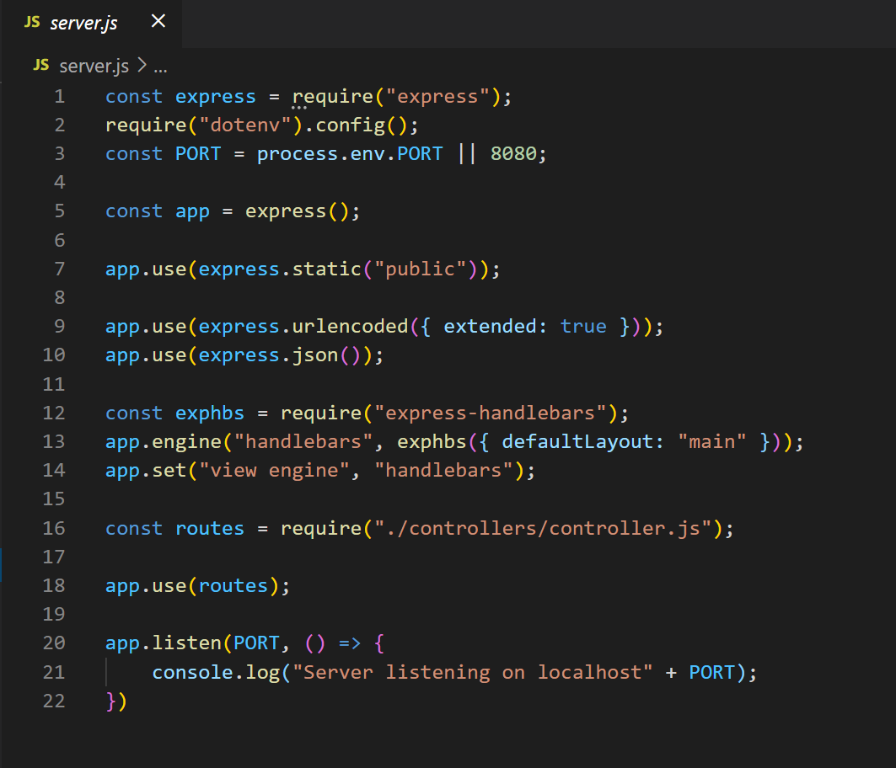
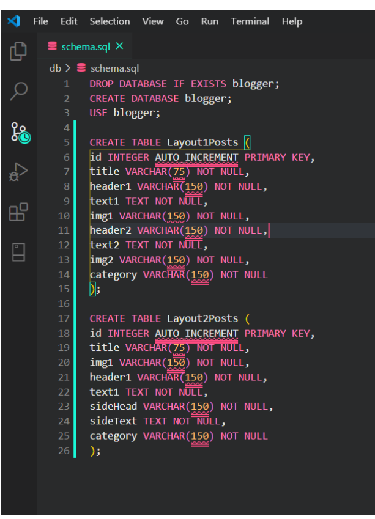
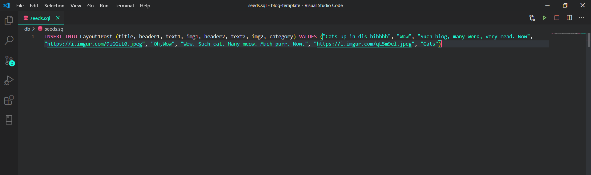

# blog-template

# Description
  Create and manage a website to manage and generate blogging templates, this is a secured site with a login to help protect client information and work.
  
# Website Set-Up
  1. Create a GitHUb repo called blog-template and clone it to your computer
  
  2. Make a package.json file by running npm init from the command line.
  
  3. Install the Express npm package: npm install express.

  4. Create a server.js file.

     
  
 
 

 

  
  5. Install the Handlebars npm package: npm install express-handlebars.

      
  
 
 

 

  6. Install MySQL npm package: npm install mysql.

  7. Require the following npm packages inside of the server.js file:

* express DB Setup
1. Inside your blog_template directory, create a folder named db.

2. In the db folder, create a file named schema.sql. Write SQL queries this file that do the following:

3. Create the blogger.

4. Switch to or use the blogger.

5. Create a blogger table with these fields for each of the templates:

    1. id: an auto incrementing int that serves as the primary key.

        
  
 
 

 

6. Still in the db folder, create a seeds.sql file. In this file, write insert queries to populate the burgers table with at least three entries.

    
  
 
 

 

7. Run the schema.sql and seeds.sql files into the mysql server from the command line

* Run SQL files.

1. Make sure you're in the db folder of your app.

2. Start MySQL command line tool and login: mysql -u root -p.

3. With the mysql> command line tool running, enter the command source schema.sql. This will run your schema file and all of the queries in it -- in other words, you'll be creating your database.

4. Now insert the entries you defined in seeds.sql by running the file: source seeds.sql.

5. Close out of the MySQL command line tool: exit.

* Controller setup

1. Inside your blogger directory, create a folder named controllers.

2. In controllers, create the controller.js file.

3. Inside the controller.js file, import the following:

* Express
1. index.js

    
  
 
 

 

    
  
 
 

 

2. Create the router for the app, and export the router at the end of your file.

* View setup

1. Inside your blogger directory, create a folder named views.

2. Create the index.handlebars file inside views directory.

3. Create the layouts directory inside views directory.

4. Create the main.handlebars file inside layouts directory.

    
  
 
 

 

5. Setup the main.handlebars file so it's able to be used by Handlebars.

6. Setup the index.handlebars to have the template that Handlebars can render onto.

7. Create a form and buttons in post.handlebars that will submit the user input into the database via the form provided on the blogger template page.

 
  
 
 

 

8. Create buttons to link the forms page to the greeting page and the post page back to home page.

  
  
 
 

 

  
  
 
 

 

9. Link layouts, home and post buttons through the bloginputs.js.

  
  
 
 

 

 
  
 
 

 

* Creating Layouts

1. 

* Creating the Authentication Page

1. 